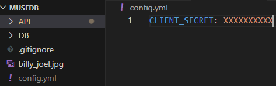

# MuseDB
## Setup For Developement Guide
- Have a working instance of python
- Install our python packages using 'pip install -r requirements.txt'
- Acquire our Client Secret, should be in the repository in Repository Secrets
    - Place the client secret in a yaml file in the main directory titled "config.yml"
    - The secret should correspond to "CLIENT_SECRET"
    - The final result should look something like this, with the Xs replaced with the client secret

    
- Rename the Setup_DB folder to just 'DB' to get a local DB
- Run the command 'uvicorn main:app --reload' from the API directory
    - If this does not work, you may need to run 'python -m uvicorn main:app --reload'
- The API should now be running. Look at the result of the uvicorn function to learn where, but it is usually 127.0.0.1:8000
- If you want to see a good view of our endpoints and test them, check out the /docs page, where swagger is hooked up. (127.0.0.1:8000/docs)
